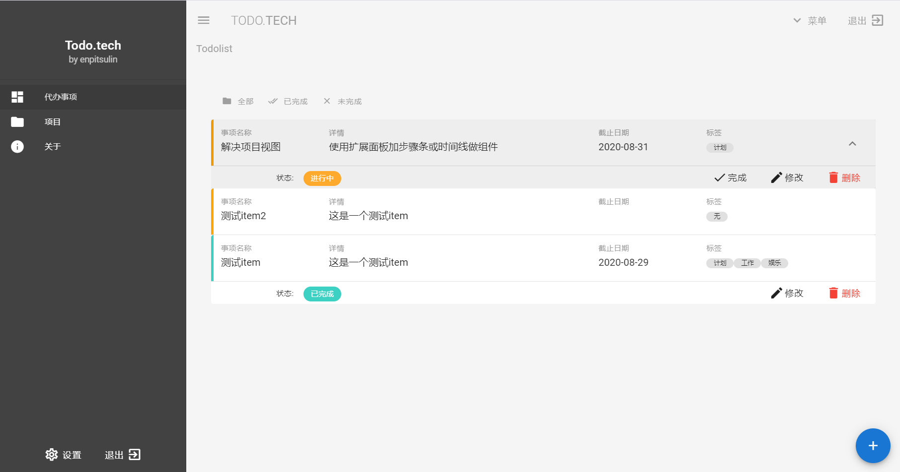
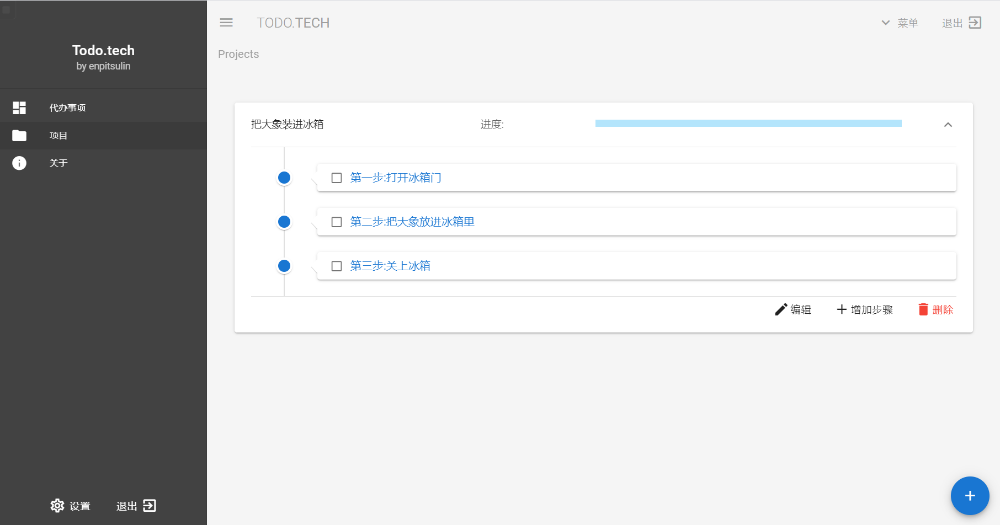
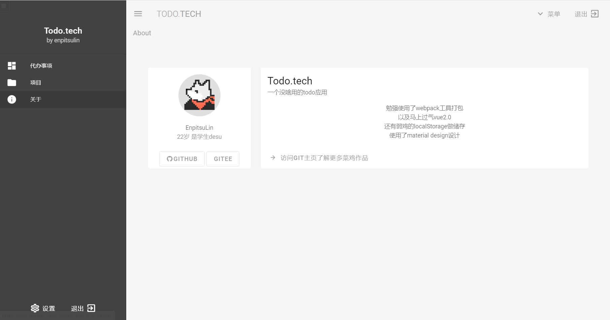
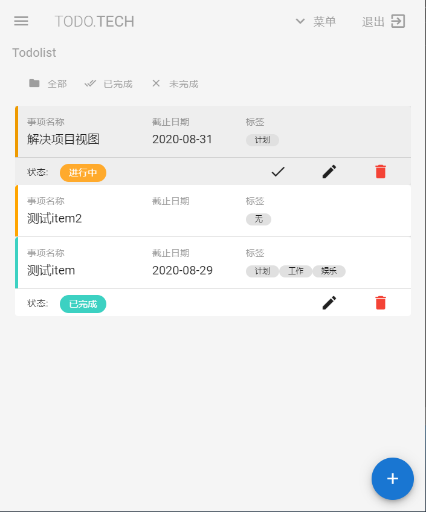
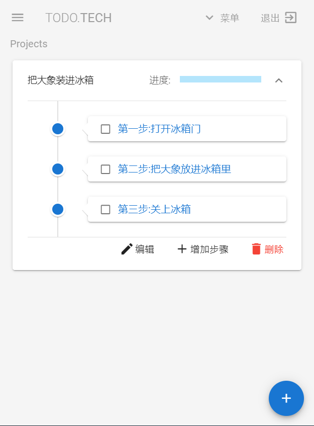
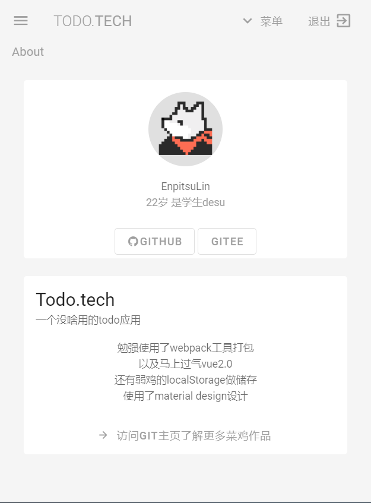

# TodoList 待办事项

## 安装

### 克隆本仓库

```shell
git clone git@gitee.com:enpitsulin/vue-todo.git
```

### 安装依赖

```shell
# pnpm
pnpm i
# npm
npm install
```

### 运行开发服务器

```shell
# pnpm
pnpm start
# npm
npm run start
```

### 构建部署文件

```shell
# pnpm
pnpm build
# npm
npm run build
```

## 部分预览







自带响应式布局

### 移动端预览:






